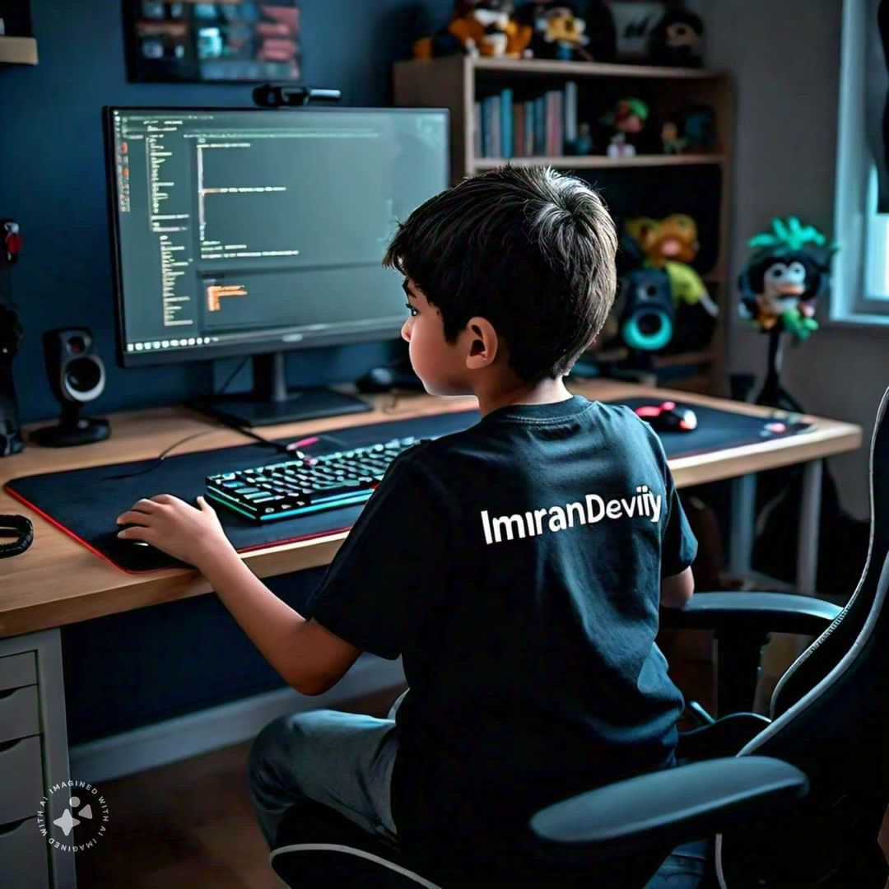

  

###

<h3 align="left">👋 Hi there, How Are You? 🙋‍♂️</h3>

###

<h1 align="center">I am Imran Safdar 👨‍💻</h1>

###

<h4 align="center">I am a passionate web developer dedicated to creating beautiful and professional web designs.</h4>

###

<h3 align="left">About me:</h3>

###

- 👋 Hi, I’m @ImranSafdar360  - 👀 I’m interested in Programming and from my childhood I wish to become a Software Engineer. -  So I started learning web development.  - 🌱 I’m currently learning JS and React.js because I decided to go as a Frontend Developer.  - 💞️ I’m looking to collaborate with Some senior Developers that may Help me to become a successful Frontend Developer.  - 🌱 I’m currently learning **React Js**  - 💬 Ask me about **React, Gsap, JavaScript,**  - ⚡ Fun fact **I am a Gamer**

###

<h3 align="left">My Expertise:</h3>

###

  
  
  
  
  
  
  
  
  
  
  
  
  
  
  
  
  
  
  
  
  
  
  

###

<h3 align="left">Connect With Me:</h3>

###

-- 📩 Email: imransafdar360@gmail.com -- 🔢 WhatsApp: 0349-4898190

###

  

    

###
